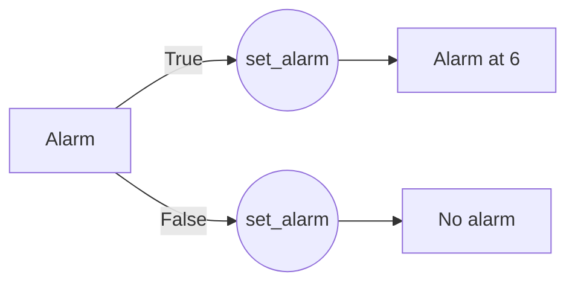
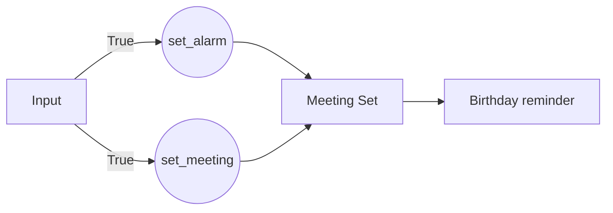

# **Conditional Response Variation**

As programmers, we are accustomed to use “if-else” or “while” conditions in computer programs, irrespective of the programming language, as a means to control the flow of our code. This forms the basis to almost any application we use these days. 
>If you have never used Rasa, you can start by installing it on your system from [here](https://rasa.com/docs/rasa/installation/). Another way to experiment with Rasa assistant would be to use their [playground](https://rasa.com/docs/rasa/playground/). As Rasa is open-source, don't forget to put a star on the GitHub repository [here](https://github.com/RasaHQ/rasa).

While working with the Rasa assistant, we have to navigate with various components like intent, story, channel, slot and forms. 

One of the key elements of the assistant is the **Response** section *domain.yml*.  Like the name suggests it is basically the set of answers that the assistant provides to the user. We can add different variables in the response section to customize the answers accordingly. Following is one of the examples for the same
```
responses:
  utter_message:
  	- text: "Hello, How can I help you?"
```

We can also add multiple responses to one particular action from which then Rasa would randomly choose a response and display it to the user. These multiple responses to one action are called **response variations**. One example is as follows : 
```
responses:
  utter_message:
  	- text: "Hello, How can I help you?"
	- text: "Hi there, What can I do for you?"
	- text: "Hola, How may I assist you?"
	- text: "Hey, How can I make things better for you?"
```
We know what you might be thinking now 
 > What if I want to display one specific response only when a certain condition(s) is satisfied? 
 <p align="center">
  
</p></img>

Well, that’s exactly what **conditional response variations** are for or as we call it CRV. A CRV is a general response variation with a specific condition applied to it. 

While declaring a condition we have to take care of three parameters which are - `type`, `name` and `value`. 
- `type` is mostly referencing to conditions inside a slot so its value will be exactly that - `slot`. 
- For the `name`, it expects the name of the variable of the slot, which we are writing the condition for.
- `value`, takes the input as Boolean i.e. `True` or `False`.
```
responses:
	utter_message:
	-  condition:
		-  type: slot
		   name: set_alarm
		   value: true
	   text: "Alarm at 6"
	-  condition:
		-  type: slot
		   name: set_alarm
		   value: false
	   text: "No alarm"
		  
```
After reading the values from the slot, there is a check for CRV condition and whichever condition is satisfied, accordingly the response becomes available for usage by Rasa assistant. We can also simply understand it using a flow diagram. 

Now the question arises is -
> But what if there are multiple CRVs with satisfied constraints then how will assistant decide the response?
<p align="center">
  
</p></img>

 
Well, if that is the case then Rasa will choose one satisfied CRV randomly and display it, just like shown in the following example

```
responses:
	utter_message:
		-  condition:
			-  type: slot
			   name: set_alarm
			   value: true
		   text: "Hi, You have alarm set today.
		-  condition:
			-  type: slot
			   name: set_meeting
			   value: true
		   text: "Hi, You have a meeting set for today.
	utter_birthday_remind:
		   text: "Hi, today's your friend's birthday! Don't forget to wish!"
```
The flow of the whole story will look something like this



The input is checked for answers and if both `set_alarm` or `set_reminder` is set then Rasa will choose one condition randomly and display that. The probability of any condition to be chosen randomly is equal. At the end, the birthday reminder is given irrespective of the path chosen above. 

This blog post tries to give a brief working overview of how responses work in Rasa, specifically CRV. In case, if you are more interested to dive deeper, you can go to the official documentation on Rasa website [here](https://rasa.com/docs/rasa/responses/#conditional-response-variations) or their github repo [here](https://github.com/RasaHQ/rasa).
